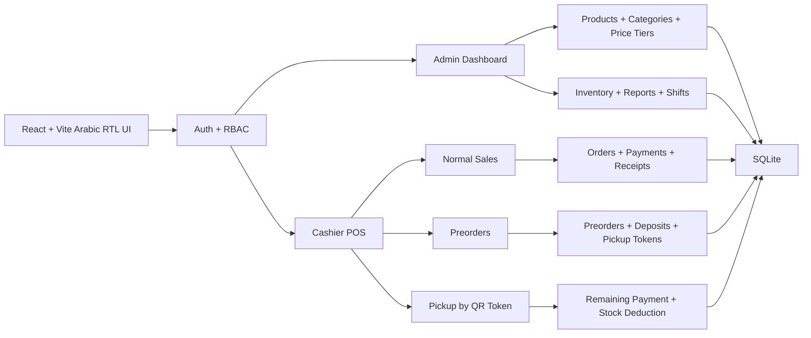
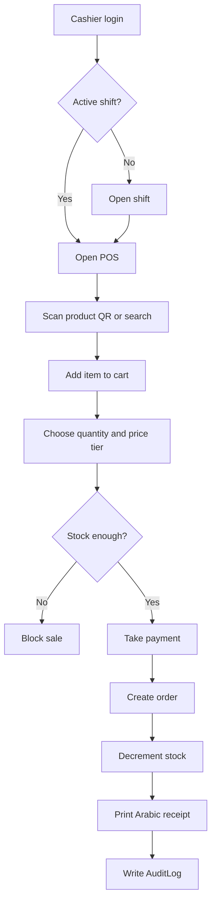
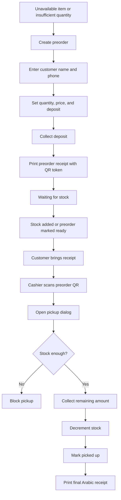
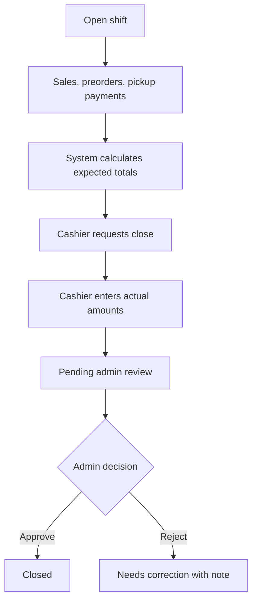

<a id="top"></a>

<style>
.prd-root { direction: ltr; text-align: left; line-height: 1.75; }
.prd-root table { width: 100%; border-collapse: collapse; }
.prd-root th, .prd-root td { padding: 8px 10px; border: 1px solid #d0d7de; vertical-align: top; }
.prd-root code, .prd-root pre { direction: ltr; text-align: left; }
.top-link { display: inline-flex; align-items: center; gap: 6px; margin-top: 12px; padding: 6px 11px; border: 1px solid #d0d7de; border-radius: 999px; text-decoration: none; font-size: 13px; font-weight: 700; }
.top-link svg { flex: 0 0 auto; }
.ar-rtl { direction: rtl; text-align: right; }
</style>

<div class="prd-root">

# A4 Office Products POS Platform — Simplified PRD

| Item | Decision |
|---|---|
| Product name | A4 Office Products POS Platform |
| Product type | Single-branch POS, cashier, preorder, inventory, and admin platform |
| Main business | Bookstore and office-products retail, with generic product support |
| Frontend | React + Vite |
| Backend | Node.js + Express |
| Database | SQLite |
| Currency | EGP |
| Timezone | Africa/Cairo |
| App language | Arabic RTL only for all user-facing screens and receipts |
| Product images | Not included in the base product model or UI |
| POS devices | No device or terminal tracking; use authenticated account + active shift only |
| Last updated | 2026-07-10 |

## Contents

1. [Product summary](#summary)
2. [Core goals](#goals)
3. [Scope](#scope)
4. [Language and compatibility rules](#language)
5. [Roles and permissions](#roles)
6. [Shifts and closing](#shifts)
7. [Products and categories](#products)
8. [Price tiers](#price-tiers)
9. [Inventory and preorder counters](#inventory)
10. [Normal POS sale](#normal-sale)
11. [Preorders and deposits](#preorders)
12. [QR tokens and labels](#qr)
13. [Receipts and printing](#printing)
14. [Payments](#payments)
15. [Customers](#customers)
16. [Reports and KPIs](#reports)
17. [Audit logs](#audit)
18. [Required pages](#pages)
19. [Operational flows](#flows)
20. [Backend modules](#backend)
21. [API target map](#api)
22. [SQLite schema target](#sqlite-schema)
23. [Error-prevention rules](#guards)
24. [Acceptance criteria](#acceptance)
25. [Suggested repo structure](#structure)
26. [Agent Pack execution rules](#agent-pack)

---

<a id="summary"></a>
## 1. Product summary

A4 Office Products POS Platform is a complete cashier and admin system for a single A4 bookstore branch. It supports normal sales, preorders with deposits, pickup using a QR token, stock control, receipts, product QR labels, cashier shifts, admin approval, reports, and audit logs.

The system is designed for books and office products, but the product model is generic enough for any retail item. Book-specific fields are optional.

<a class="top-link" href="#top" title="Back to top"><svg aria-hidden="true" viewBox="0 0 24 24" width="15" height="15"><path d="M12 5l-7 7 1.4 1.4L11 8.8V20h2V8.8l4.6 4.6L19 12z" fill="currentColor"/></svg><span>Back to top</span></a>

---

<a id="goals"></a>
## 2. Core goals

- Fast cashier POS flow using product QR scanning or product search.
- Normal sales that decrement stock immediately.
- Preorders for unavailable or insufficient stock items.
- Deposit collection and printed preorder receipt with pickup QR token.
- Pickup flow that scans the preorder QR token, shows a pickup dialog, collects the remaining amount, decrements stock, and prints the final receipt.
- Clear separation between Admin and Cashier permissions.
- Shift-based financial tracking and admin approval.
- SQLite database with a clear relational schema and migrations.
- Arabic RTL app experience from the first screen to the final receipt.

<a class="top-link" href="#top" title="Back to top"><svg aria-hidden="true" viewBox="0 0 24 24" width="15" height="15"><path d="M12 5l-7 7 1.4 1.4L11 8.8V20h2V8.8l4.6 4.6L19 12z" fill="currentColor"/></svg><span>Back to top</span></a>

---

<a id="scope"></a>
## 3. Scope

### In scope

- Admin dashboard.
- Cashier POS screen.
- Login and session handling.
- Admin and Cashier roles.
- Generic products without images.
- Categories.
- Admin-managed price tiers.
- SQLite-backed inventory ledger.
- Normal paid sales.
- Preorders with required customer name and phone.
- Deposit and remaining-payment handling.
- Product QR labels for POS cart entry.
- Preorder QR token for pickup.
- Sales receipt, preorder receipt, and final pickup receipt.
- Receipt printer and QR-label printer workflows.
- Shift opening, closing request, and admin approval.
- Payment methods and split payments.
- Reports, KPIs, exports, and audit logs.

### Out of scope for the base version

- Multiple branches.
- Product images.
- Customer online store.
- Mobile app.
- POS device or terminal tracking.
- Selling outside the platform.
- Negative inventory.
- Complex custom roles beyond Admin and Cashier.

<a class="top-link" href="#top" title="Back to top"><svg aria-hidden="true" viewBox="0 0 24 24" width="15" height="15"><path d="M12 5l-7 7 1.4 1.4L11 8.8V20h2V8.8l4.6 4.6L19 12z" fill="currentColor"/></svg><span>Back to top</span></a>

---

<a id="language"></a>
## 4. Language and compatibility rules

The implementation prompt and technical files may use English for code, API routes, table names, and developer documentation. The actual product UI must be Arabic RTL only.

User-facing Arabic requirements:

- All menus, buttons, labels, forms, tables, dialogs, validation messages, errors, reports, receipts, and print templates must be Arabic RTL.
- The root app must use `dir="rtl"` and Arabic typography rules.
- English technical tokens such as `SKU`, `QR`, `API`, and route names may appear only where useful, but they must not break RTL layout.
- Do not start Arabic headings or bullets with `QR`; write Arabic phrasing such as “رمز QR” or “رمز المنتج”.
- Receipts must be Arabic and printable on thermal printers.

<a class="top-link" href="#top" title="Back to top"><svg aria-hidden="true" viewBox="0 0 24 24" width="15" height="15"><path d="M12 5l-7 7 1.4 1.4L11 8.8V20h2V8.8l4.6 4.6L19 12z" fill="currentColor"/></svg><span>Back to top</span></a>

---

<a id="roles"></a>
## 5. Roles and permissions

### Admin

Admin can manage:

- Cashier accounts and passwords.
- Products, categories, price tiers, and inventory.
- Preorders, sales, receipts, and reports.
- Global revenue and KPIs.
- Shift review, approval, and rejection.
- Payment methods, business settings, and printer settings.
- Audit logs.

### Cashier

Cashier can only:

- Open or resume their own active shift.
- Use the POS screen.
- Scan product QR tokens or search products.
- Create normal sales.
- Create preorders and collect deposits.
- Scan preorder QR tokens and complete pickup.
- Print and reprint allowed receipts.
- View and close their own shift.

Cashier cannot:

- View global revenue or KPIs.
- View another cashier’s revenue or shift details.
- Change their own name, password, or permissions.
- Manage products, prices, inventory, or users.
- Approve shifts.

<a class="top-link" href="#top" title="Back to top"><svg aria-hidden="true" viewBox="0 0 24 24" width="15" height="15"><path d="M12 5l-7 7 1.4 1.4L11 8.8V20h2V8.8l4.6 4.6L19 12z" fill="currentColor"/></svg><span>Back to top</span></a>

---

<a id="shifts"></a>
## 6. Shifts and closing

There is no POS device model. Every operation belongs to the authenticated user and the active shift.

Shift rules:

- No sale, preorder, payment, pickup, or receipt action without an active cashier shift.
- Each cashier can have only one active shift at a time.
- Multiple cashiers can have open shifts at the same time.
- Cashier sees only their own shift summary.
- Admin sees all shifts.

Closing flow:

1. Cashier requests shift closing.
2. System calculates expected totals by payment method.
3. Cashier enters actual collected amounts.
4. Shift becomes `PENDING_ADMIN_REVIEW`.
5. Admin approves or rejects with a note.
6. Approved shift becomes `CLOSED`.

<a class="top-link" href="#top" title="Back to top"><svg aria-hidden="true" viewBox="0 0 24 24" width="15" height="15"><path d="M12 5l-7 7 1.4 1.4L11 8.8V20h2V8.8l4.6 4.6L19 12z" fill="currentColor"/></svg><span>Back to top</span></a>

---

<a id="products"></a>
## 7. Products and categories

The product model is generic and has no image field in the base version.

Core product fields:

- Name.
- SKU/internal code.
- Product QR token or barcode reference.
- Category.
- Optional description.
- Active/inactive state.
- Can be sold normally.
- Can be preordered.
- Default preorder deposit percentage.
- Default pickup method.
- Low-stock threshold.
- Optional purchase cost for estimated profit.
- Internal notes.

Optional book fields:

- Book type.
- School grade.
- Subject.
- Teacher.
- Publisher.
- Release year.
- Term: first / second.
- Educational classification: external book / school book / booklet / notes.

<a class="top-link" href="#top" title="Back to top"><svg aria-hidden="true" viewBox="0 0 24 24" width="15" height="15"><path d="M12 5l-7 7 1.4 1.4L11 8.8V20h2V8.8l4.6 4.6L19 12z" fill="currentColor"/></svg><span>Back to top</span></a>

---

<a id="price-tiers"></a>
## 8. Price tiers

Price tiers are created by Admin. Examples:

- Retail.
- Wholesale.
- Special price.
- Schools.
- Teachers.
- Distributors.

Admin sets product prices per active price tier. Cashier uses the default tier unless the system allows selecting another tier. Manual price changes must write AuditLog and may require Admin permission.

<a class="top-link" href="#top" title="Back to top"><svg aria-hidden="true" viewBox="0 0 24 24" width="15" height="15"><path d="M12 5l-7 7 1.4 1.4L11 8.8V20h2V8.8l4.6 4.6L19 12z" fill="currentColor"/></svg><span>Back to top</span></a>

---

<a id="inventory"></a>
## 9. Inventory and preorder counters

Inventory must never go below zero.

Product counters:

- `stockOnHand`: actual physical stock.
- `openPreorderQuantity`: quantities requested in open preorders.
- `availableForSale`: quantity available for immediate sale.
- `lowStockStatus`: low-stock indicator.

Normal sales decrement `stockOnHand` immediately. Preorder creation does not decrement stock. Preorder pickup decrements stock only after stock validation and remaining payment collection.

Every stock change must be written to an inventory ledger table.

<a class="top-link" href="#top" title="Back to top"><svg aria-hidden="true" viewBox="0 0 24 24" width="15" height="15"><path d="M12 5l-7 7 1.4 1.4L11 8.8V20h2V8.8l4.6 4.6L19 12z" fill="currentColor"/></svg><span>Back to top</span></a>

---

<a id="normal-sale"></a>
## 10. Normal POS sale

Normal sale flow:

1. Cashier logs in.
2. Cashier opens or resumes an active shift.
3. Cashier scans product QR or searches for the product.
4. Product is added to the cart.
5. Cashier selects quantity and price tier.
6. System validates stock.
7. Cashier selects one or more payment methods.
8. System creates the order.
9. System decrements stock.
10. System prints the sales receipt.
11. System writes AuditLog.

Base normal sales are fully paid before final receipt printing.

<a class="top-link" href="#top" title="Back to top"><svg aria-hidden="true" viewBox="0 0 24 24" width="15" height="15"><path d="M12 5l-7 7 1.4 1.4L11 8.8V20h2V8.8l4.6 4.6L19 12z" fill="currentColor"/></svg><span>Back to top</span></a>

---

<a id="preorders"></a>
## 11. Preorders and deposits

Preorders are used when a product is not available or the required quantity is not available.

Required customer fields:

- Customer name.
- Customer phone.

Preorder data:

- Items and quantities.
- Price tier and price snapshot.
- Total amount.
- Deposit percentage or deposit amount.
- Paid deposit.
- Remaining amount.
- Payment method.
- Pickup method.
- Optional expected pickup date.
- Notes.

Preorder statuses:

- `DRAFT`.
- `DEPOSIT_PAID_WAITING_STOCK`.
- `READY_FOR_PICKUP`.
- `PICKED_UP`.
- `CANCELLED`.
- `EXPIRED`.

Pickup flow:

1. Customer brings the preorder receipt.
2. Cashier scans the preorder QR token.
3. System opens a pickup dialog.
4. Dialog shows customer, items, deposit, remaining amount, and stock state.
5. Cashier collects the remaining amount.
6. System validates stock.
7. System decrements stock.
8. System decreases open preorder counters.
9. System marks preorder as picked up.
10. System prints the final pickup receipt.
11. System writes AuditLog.

<a class="top-link" href="#top" title="Back to top"><svg aria-hidden="true" viewBox="0 0 24 24" width="15" height="15"><path d="M12 5l-7 7 1.4 1.4L11 8.8V20h2V8.8l4.6 4.6L19 12z" fill="currentColor"/></svg><span>Back to top</span></a>

---

<a id="qr"></a>
## 12. QR tokens and labels

Product QR tokens:

- Used to add products to the POS cart.
- Printed as product labels.
- Must not contain product price or stock.
- Should contain only a server-resolvable token, SKU, or barcode value.

Preorder QR tokens:

- Printed on the preorder receipt.
- Used to open pickup inside the authenticated app only.
- Must be secure tokens, not plain visible database IDs.
- Must require Cashier or Admin login.

Receipt QR tokens:

- Printed on final receipts when needed.
- Used for internal lookup or reprint.
- Reprints must write AuditLog.

<a class="top-link" href="#top" title="Back to top"><svg aria-hidden="true" viewBox="0 0 24 24" width="15" height="15"><path d="M12 5l-7 7 1.4 1.4L11 8.8V20h2V8.8l4.6 4.6L19 12z" fill="currentColor"/></svg><span>Back to top</span></a>

---

<a id="printing"></a>
## 13. Receipts and printing

Required print templates:

1. Normal sale receipt.
2. Preorder deposit receipt.
3. Final preorder pickup receipt.
4. Product QR label template.

Receipts must be Arabic RTL and thermal-printer friendly.

Receipt content includes:

- A4 business name.
- Invoice or preorder number.
- Date and time.
- Cashier name.
- Customer name and phone for preorders.
- Items, quantities, prices, discounts, and totals.
- Payment methods.
- Deposit and remaining amounts for preorders.
- QR token when needed.

<a class="top-link" href="#top" title="Back to top"><svg aria-hidden="true" viewBox="0 0 24 24" width="15" height="15"><path d="M12 5l-7 7 1.4 1.4L11 8.8V20h2V8.8l4.6 4.6L19 12z" fill="currentColor"/></svg><span>Back to top</span></a>

---

<a id="payments"></a>
## 14. Payments

Default payment methods:

- Cash.
- Visa/Card.
- InstaPay.
- Wallet.
- Bank transfer.

Admin can manage payment methods. Orders and preorders can use split payments. Shift closing must group expected and actual totals by payment method.

<a class="top-link" href="#top" title="Back to top"><svg aria-hidden="true" viewBox="0 0 24 24" width="15" height="15"><path d="M12 5l-7 7 1.4 1.4L11 8.8V20h2V8.8l4.6 4.6L19 12z" fill="currentColor"/></svg><span>Back to top</span></a>

---

<a id="customers"></a>
## 15. Customers

Normal sale can use a generic walk-in customer.

Preorder requires:

- Customer name.
- Customer phone.

Customer name and phone must appear on the preorder receipt and final pickup receipt.

<a class="top-link" href="#top" title="Back to top"><svg aria-hidden="true" viewBox="0 0 24 24" width="15" height="15"><path d="M12 5l-7 7 1.4 1.4L11 8.8V20h2V8.8l4.6 4.6L19 12z" fill="currentColor"/></svg><span>Back to top</span></a>

---

<a id="reports"></a>
## 16. Reports and KPIs

Admin reports:

- Sales totals.
- Deposit totals.
- Remaining preorder payments.
- Totals by payment method.
- Sales invoices count.
- Preorders count.
- Open preorders.
- Ready-for-pickup preorders.
- Picked-up preorders.
- Low stock.
- Best-selling products.
- Most-preordered products.
- Reports by category, cashier, shift, and date range.
- Exportable reports.

Cashier summary:

- Own active shift only.
- Own sales count and totals.
- Own preorder deposits and pickup payments.
- Expected closing totals by payment method.

<a class="top-link" href="#top" title="Back to top"><svg aria-hidden="true" viewBox="0 0 24 24" width="15" height="15"><path d="M12 5l-7 7 1.4 1.4L11 8.8V20h2V8.8l4.6 4.6L19 12z" fill="currentColor"/></svg><span>Back to top</span></a>

---

<a id="audit"></a>
## 17. Audit logs

AuditLog is required for:

- Login/logout.
- Shift open, close request, approval, and rejection.
- Product, category, price-tier, and inventory changes.
- Normal sales.
- Preorder creation and pickup.
- Payment actions.
- Receipt print and reprint.
- Product QR label generation and printing.
- User management.
- Admin review actions.

AuditLog records should include user, shift when available, action type, entity type, entity ID, before/after values when needed, timestamp, and notes.

<a class="top-link" href="#top" title="Back to top"><svg aria-hidden="true" viewBox="0 0 24 24" width="15" height="15"><path d="M12 5l-7 7 1.4 1.4L11 8.8V20h2V8.8l4.6 4.6L19 12z" fill="currentColor"/></svg><span>Back to top</span></a>

---

<a id="pages"></a>
## 18. Required pages

Cashier pages:

- Arabic login page.
- POS screen.
- Product scan/search.
- Cart.
- Checkout and receipt print.
- Preorder creation.
- Preorder QR scan.
- Pickup dialog.
- Current shift.
- Shift close request.

Admin pages:

- Arabic dashboard.
- Users and cashiers.
- Categories.
- Price tiers.
- Products.
- Inventory.
- Preorders.
- Sales and invoices.
- Payments.
- Shift review.
- Reports and KPIs.
- Audit logs.
- Printer settings.
- Business settings.

<a class="top-link" href="#top" title="Back to top"><svg aria-hidden="true" viewBox="0 0 24 24" width="15" height="15"><path d="M12 5l-7 7 1.4 1.4L11 8.8V20h2V8.8l4.6 4.6L19 12z" fill="currentColor"/></svg><span>Back to top</span></a>

---

<a id="flows"></a>
## 19. Operational flows

### 19.1 Platform overview



### 19.2 Normal sale



### 19.3 Preorder and pickup



### 19.4 Shift closing



<a class="top-link" href="#top" title="Back to top"><svg aria-hidden="true" viewBox="0 0 24 24" width="15" height="15"><path d="M12 5l-7 7 1.4 1.4L11 8.8V20h2V8.8l4.6 4.6L19 12z" fill="currentColor"/></svg><span>Back to top</span></a>

---

<a id="backend"></a>
## 20. Backend modules

| Module | Responsibility |
|---|---|
| Auth | Login, refresh, logout, current user. |
| Users | Admin-managed users and cashiers. |
| RBAC | Admin/Cashier access control. |
| AuditLog | Required logs for sensitive and financial actions. |
| Categories | Product categories. |
| PriceTiers | Retail, wholesale, and custom tiers. |
| Products | Generic products without images and optional book fields. |
| Product QR | Product token generation and label data. |
| Inventory | Stock counters and inventory ledger. |
| Customers | Required preorder customer name and phone. |
| Orders | Normal sale invoices. |
| Preorders | Deposit, pickup token, ready state, and pickup. |
| Payments | Payment methods and split payments. |
| Receipts | Numbering, templates, print, and reprint. |
| Shifts | Open, summary, close request, admin approval. |
| Reports | Sales, preorders, inventory, shifts, payment methods, cashiers. |
| Settings | Business and printer settings. |

<a class="top-link" href="#top" title="Back to top"><svg aria-hidden="true" viewBox="0 0 24 24" width="15" height="15"><path d="M12 5l-7 7 1.4 1.4L11 8.8V20h2V8.8l4.6 4.6L19 12z" fill="currentColor"/></svg><span>Back to top</span></a>

---

<a id="api"></a>
## 21. API target map

### Auth

| Method | Path | Purpose |
|---|---|---|
| `POST` | `/api/auth/login` | Login. |
| `POST` | `/api/auth/refresh` | Refresh session. |
| `POST` | `/api/auth/logout` | Logout. |
| `GET` | `/api/auth/me` | Current user and permissions. |

### Admin users

| Method | Path | Purpose |
|---|---|---|
| `GET` | `/api/admin/users` | List users. |
| `POST` | `/api/admin/users` | Create user. |
| `PATCH` | `/api/admin/users/:id` | Update user. |
| `PATCH` | `/api/admin/users/:id/password` | Change password. |
| `PATCH` | `/api/admin/users/:id/disable` | Disable user. |

### Products and categories

| Method | Path | Purpose |
|---|---|---|
| `GET` | `/api/categories` | List active categories. |
| `POST` | `/api/admin/categories` | Create category. |
| `PATCH` | `/api/admin/categories/:id` | Update category. |
| `GET` | `/api/admin/price-tiers` | List price tiers. |
| `POST` | `/api/admin/price-tiers` | Create price tier. |
| `GET` | `/api/products` | Search products. |
| `POST` | `/api/admin/products` | Create product. |
| `PATCH` | `/api/admin/products/:id` | Update product. |
| `POST` | `/api/admin/products/:id/qr-labels` | Prepare QR labels. |

### POS

| Method | Path | Purpose |
|---|---|---|
| `POST` | `/api/pos/scan-product` | Resolve product QR token. |
| `GET` | `/api/pos/products/search` | Search products. |
| `POST` | `/api/pos/orders/checkout` | Create normal sale. |
| `GET` | `/api/pos/receipts/:id` | Get receipt data. |
| `POST` | `/api/pos/receipts/:id/reprint` | Reprint receipt. |

### Preorders

| Method | Path | Purpose |
|---|---|---|
| `POST` | `/api/pos/preorders` | Create preorder with deposit. |
| `POST` | `/api/pos/preorders/scan` | Resolve preorder QR token. |
| `POST` | `/api/pos/preorders/:id/pickup` | Complete pickup. |
| `GET` | `/api/admin/preorders` | Admin preorder list with filters. |
| `PATCH` | `/api/admin/preorders/:id/status` | Admin status update. |

### Shifts and reports

| Method | Path | Purpose |
|---|---|---|
| `POST` | `/api/shifts/open` | Open cashier shift. |
| `GET` | `/api/shifts/current` | Current cashier shift. |
| `POST` | `/api/shifts/current/close-request` | Request shift closing. |
| `GET` | `/api/admin/shifts` | List shifts. |
| `POST` | `/api/admin/shifts/:id/approve` | Approve shift close. |
| `POST` | `/api/admin/shifts/:id/reject` | Reject shift close. |
| `GET` | `/api/admin/kpis` | Admin KPIs. |
| `GET` | `/api/admin/reports/sales` | Sales report. |
| `GET` | `/api/admin/reports/preorders` | Preorders report. |
| `GET` | `/api/admin/reports/inventory` | Inventory report. |
| `GET` | `/api/admin/reports/shifts` | Shifts report. |

<a class="top-link" href="#top" title="Back to top"><svg aria-hidden="true" viewBox="0 0 24 24" width="15" height="15"><path d="M12 5l-7 7 1.4 1.4L11 8.8V20h2V8.8l4.6 4.6L19 12z" fill="currentColor"/></svg><span>Back to top</span></a>

---

<a id="sqlite-schema"></a>
## 22. SQLite schema target

SQLite rules:

- Use SQLite only in the base version.
- Enable foreign keys with `PRAGMA foreign_keys = ON`.
- Use migrations, not manual ad-hoc tables.
- Store money as integer minor units, not floating point.
- Store timestamps consistently and display them in Africa/Cairo.
- Add indexes for lookup-heavy fields: SKU, QR tokens, phone, status, date, shift, cashier.

Target tables:

- `users`
- `sessions` or refresh-token table
- `categories`
- `price_tiers`
- `products`
- `product_book_details`
- `product_prices`
- `qr_tokens`
- `inventory_ledger`
- `customers`
- `orders`
- `order_items`
- `preorders`
- `preorder_items`
- `payments`
- `receipts`
- `shifts`
- `cash_movements`
- `audit_logs`
- `business_settings`
- `printer_settings`

<a class="top-link" href="#top" title="Back to top"><svg aria-hidden="true" viewBox="0 0 24 24" width="15" height="15"><path d="M12 5l-7 7 1.4 1.4L11 8.8V20h2V8.8l4.6 4.6L19 12z" fill="currentColor"/></svg><span>Back to top</span></a>

---

<a id="guards"></a>
## 23. Error-prevention rules

- No sale without active shift.
- No preorder creation without active shift.
- No preorder pickup without active shift.
- No checkout when stock is insufficient.
- Inventory must never go below zero.
- No preorder without customer name and phone.
- No pickup without valid QR token or Admin-authorized lookup.
- No shift approval by Cashier.
- No global KPIs for Cashier.
- No product images in the base model or UI.
- No POS device tracking.
- No print/reprint without AuditLog.
- No hard delete for financial data.
- No MongoDB/Mongoose code in this project.

<a class="top-link" href="#top" title="Back to top"><svg aria-hidden="true" viewBox="0 0 24 24" width="15" height="15"><path d="M12 5l-7 7 1.4 1.4L11 8.8V20h2V8.8l4.6 4.6L19 12z" fill="currentColor"/></svg><span>Back to top</span></a>

---

<a id="acceptance"></a>
## 24. Acceptance criteria

- Admin can create and manage cashiers.
- Cashier can open a shift and sell by QR scan or search.
- Stock blocks normal sales when insufficient.
- Admin can see stock on hand and open preorder quantities.
- Cashier can create preorder with required customer name, phone, and deposit.
- Preorder receipt contains a valid pickup QR token.
- Scanning pickup QR opens a pickup dialog.
- Pickup collects remaining amount, decrements stock, marks preorder picked up, and prints final receipt.
- Cashier sees only their own shift.
- Admin reviews and approves shift closing.
- Reports cover sales, preorders, inventory, shifts, and payment methods.
- All sensitive and financial actions write AuditLog.
- UI is Arabic RTL across the full app.
- Agent Pack executes exactly one step per run.

<a class="top-link" href="#top" title="Back to top"><svg aria-hidden="true" viewBox="0 0 24 24" width="15" height="15"><path d="M12 5l-7 7 1.4 1.4L11 8.8V20h2V8.8l4.6 4.6L19 12z" fill="currentColor"/></svg><span>Back to top</span></a>

---

<a id="structure"></a>
## 25. Suggested repo structure

```txt
repo/
  agent_pack/
    prompts/
    docs/
    steps/
    checklists/
    reports/
    status.json
  server/
    src/
      app.js
      server.js
      config/
      db/
      migrations/
      middleware/
      modules/
        auth/
        users/
        rbac/
        auditLogs/
        categories/
        priceTiers/
        products/
        inventory/
        customers/
        orders/
        preorders/
        payments/
        receipts/
        qrTokens/
        shifts/
        reports/
        printerSettings/
        businessSettings/
      utils/
      tests/
  client/
    src/
      app/
      api/
      layouts/
      pages/
        admin/
        cashier/
      components/
      print/
      styles/
      locales/
  docs/
  .env.example
  package.json
```

<a class="top-link" href="#top" title="Back to top"><svg aria-hidden="true" viewBox="0 0 24 24" width="15" height="15"><path d="M12 5l-7 7 1.4 1.4L11 8.8V20h2V8.8l4.6 4.6L19 12z" fill="currentColor"/></svg><span>Back to top</span></a>

---

<a id="agent-pack"></a>
## 26. Agent Pack execution rules

The project must be implemented through `agent_pack/status.json` with exactly one open or pending step per run.

Each run must:

1. Read `agent_pack/prompts/ONE_PROMPT_RUNNER.md`.
2. Select exactly one open/pending step from `agent_pack/status.json`.
3. Read the selected step file fully.
4. Read all linked docs and checklists.
5. Inspect the current repository state.
6. Implement only the selected step.
7. Run verification as far as the environment allows.
8. Update `status.json` and `TASK_BOARD.md`.
9. Write a step report in `agent_pack/reports/`.
10. Stop immediately.

<a class="top-link" href="#top" title="Back to top"><svg aria-hidden="true" viewBox="0 0 24 24" width="15" height="15"><path d="M12 5l-7 7 1.4 1.4L11 8.8V20h2V8.8l4.6 4.6L19 12z" fill="currentColor"/></svg><span>Back to top</span></a>

</div>
